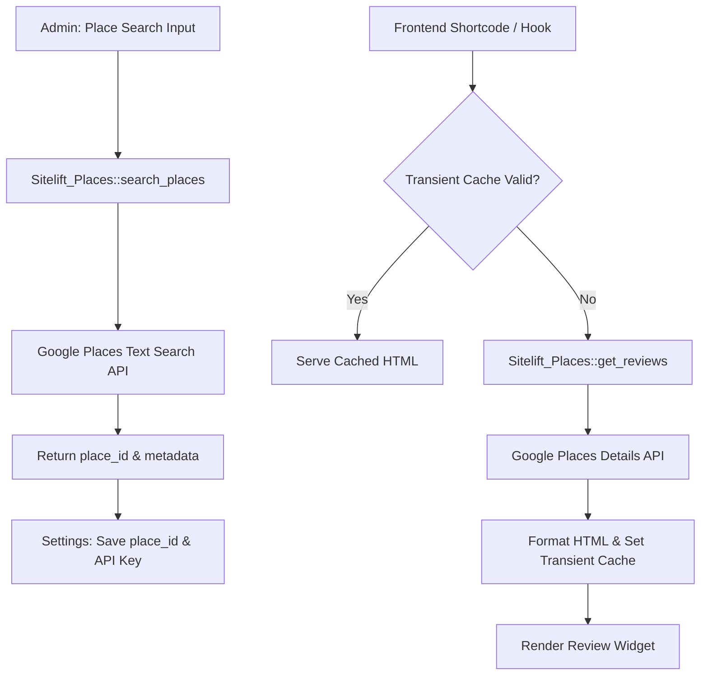

# SiteLift Grader 🌟📍

[](https://opensource.org/licenses/MIT)
[](https://www.php.net/)
[](https://wordpress.org/)
[](https://github.com/Sitelift-Grader/sitelift-grader/pulls)

> **High-performance Google Places review integration & Places Finder engine for WordPress.**  
> Effortlessly search, embed, and cache verified Google Places customer reviews with built-in transient TTL management and zero frontend layout shift.

---

## ⚡ Key Capabilities

- **Integrated Google Places Finder**:
  - Search businesses directly from the WordPress admin dashboard via the Google Places Text Search API.
  - Automatically resolve and copy verified `place_id`, business name, and formatted address into plugin configurations.
- **Smart Transient Caching Engine**:
  - Leverages WordPress Transients API with configurable TTL (default: 1 hour) to reduce redundant Google API requests and respect quota limits.
  - Automatic fallback on transient expiry with zero disruption to frontend page rendering.
- **Security-First Architecture**:
  - Strict input sanitization with `sanitize_text_field()` and attribute escaping via `esc_attr()`.
  - Direct script access mitigation (`ABSPATH` check).
  - Admin nonce-based security model.
- **Responsive Review Display**:
  - Clean, accessible HTML markup rendering author names, relative time descriptions, star ratings, and review content.
  - Lightweight styling in `assets/widget.css` that respects theme aesthetics without bloated CSS frameworks.

---

## 🏗️ Architecture



---

## 📂 Codebase Structure

```
sitelift-grader/
├── admin/
│   └── page-places-finder.php    # Admin UI for Google Places text query & Place ID lookup
├── assets/
│   └── widget.css                # Scoped review card & star rating styles
├── includes/
│   └── class-sitelift-places.php # API client wrapper for Google Maps / Places endpoints
├── sitelift-grader.php           # Plugin entry point, options lifecycle, and rendering hooks
├── LICENSE                       # MIT License
└── README.md                     # Documentation & usage guide
```

---

## 🚀 Installation & Setup

1. **Clone or Download**:
   ```bash
   git clone https://github.com/Sitelift-Grader/sitelift-grader.git
   ```
2. Place the `sitelift-grader` directory into your WordPress plugins folder (`wp-content/plugins/`).
3. Activate the plugin via **Plugins > Installed Plugins** in the WordPress admin panel.
4. Navigate to **SiteLift Grader > Settings**:
   - Enter your **Google Places API Key**.
   - Use the **Places Finder** tab to search for your business and retrieve your `place_id`.
   - Configure cache TTL according to your site's traffic patterns.

---

## 🤝 Contributing

We welcome contributions, bug reports, and pull requests!
- Feel free to submit improvements for review filtering, schema.org JSON-LD microdata integration, or additional Google Places API v2 fields.

---

## 📄 License

This open-source software is licensed under the [MIT License](LICENSE).
